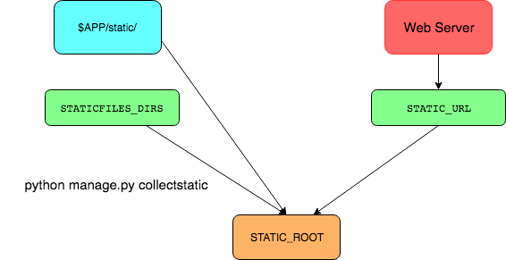
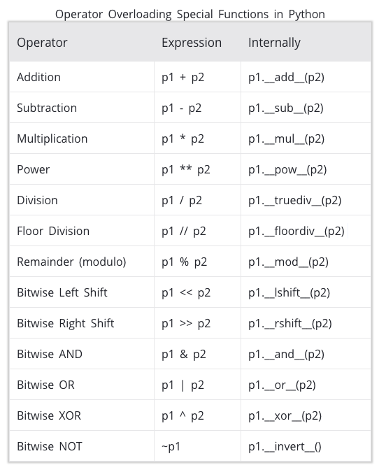
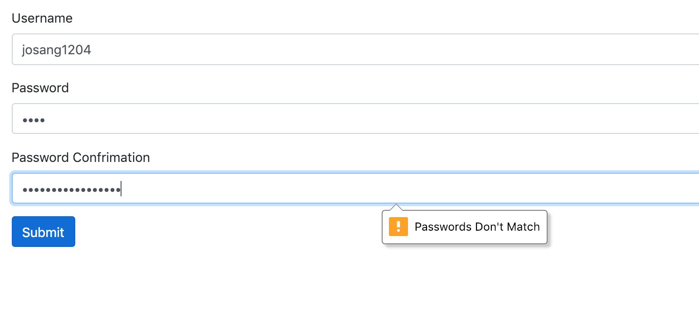
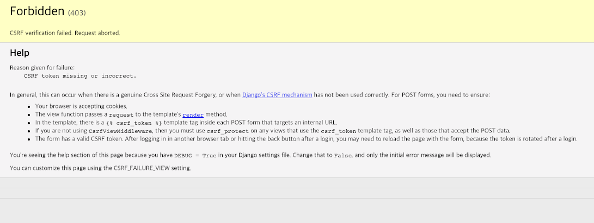

# Week 5 QnA

1. 블로그 글 쓰기 부터 만들기 - CRUD
2. 로그인 회원가입 구현
3. Pagination

> 비밀번호 검증을 Client 단에서 하기
> 
> CSRF 공격
> 
> Class 기본 및 심화
> 
> media, static 다르게는 못하나?
> 
> static_url?


## 1. STATIC_DIR?, STATIC_ROOT?, STATIC_URL?
``` python
STATIC_URL = '/static/'

STATICFILES_DIRS = [
    os.path.join(BASE_DIR, 'blog', 'static')
]

STATIC_ROOT = os.path.join(BASE_DIR, 'static')

```
위 세 변수의 역할이 무엇일까? 왜 굳이 저렇게 나눴을까?

 
 
STATIC_URL: 디플로이한 이후 웹서버에서 활용하는 주소
STATICFILES_DIRS: 개발환경에서 Static 파일들이 모여져있는 주소, manage.py collectstatic을 하면 모두 STATIC_ROOT로 이동
STATIC_ROOT: 가장 ROOT가 되는 주소, 여기에 모든 static 파일이 모아진다.


## 2.  vs  ?

서로 비슷해 보이지만 사실 정말 다르다.
전자인 load static은 단순히 STATIC_ROOT에 저장된 경로를 이용해 url를 구성하여 가져온다.
하지만 후자인 load staticfiles는 STATICFILES_STORAGE에 저장된 경로를 이용해 url을 구성하여 파일을 가져온다. 여기서 STATICFILE_STORAGE는 AWS S3와 같은 대용량 파일, CDN 같은 곳을 의미한다.
즉 static을 외부 클라우드에서 따로 관리할 경우에 설정하게 된다. 또한 로 더 명시적인 형태를 추천하고 있다.

하지만 이는 장고 1.7까지였고 2.1부터는 더이상 보이지 않는다.

**정리하자면** 
static 파일들을 프로젝트 안에서 같이 관리할 경우 load static
static 파일들을 외부 클라우드를 통해 관리할 경우 load static fromm staticfiles
하지만 load static으로도 충분하다!

**이런 식의 활용도 가능하다**
``` python




```


## 3. urls.py에서 왜 staitc()이란 걸로  media 경로 설정을 하지?

django.conf.urls.static.static()
> static.static(prefix, view=django.views.static.serve, **kwargs)¶
> 
> Helper function to return a URL pattern for serving files in debug mode:
> 
> 즉 디버그 모드에서 미디어 파일을 잘 활용하게 하기 위해서 URL패턴을 추가해줌

``` python
from django.conf import settings
from django.conf.urls.static import static

urlpatterns = [
    # ... the rest of your URLconf goes here ...
] + static(settings.MEDIA_URL, document_root=settings.MEDIA_ROOT)
```


## 4. Class 기본

``` python
class Data():
    def __init__(self):
        self._value = 0

    def get_value(self):
        print("GET VALUE")
        return self._value

    def set_value(self, value):
        print("SET VALUE")
        self._value = value
```

``` shell
data = Data()

data.get_value
>>> GET VALUE
>>> 0

data.set_value(3)
>>> SET VALUE

data.get_value
>>> 3
```

``` python
class Data():
    def __init__(self):
        self._value = 0
    // 이러한 것을 데코레이터라고 한다.
    @property
    def value(self):
        print("GET VALUE")
        return self._value

    @value.setter
    def value(self, value):
        print("SET VALUE")
        self._value = value
```

``` shell
data = Data()

data.value
>>> GET VALUE
>>> 0

data.value = 3
>>> SET VALUE

data.value
>>> 3
```

 

[도움될만한 사이트](https://www.programiz.com/python-programming/property)


## 5. 패스워드 검증을 프론트 단에서 할 수 없을까?
> setCustomValidity()을 활용한다!
``` html
<form method="post" action="">
    
    <div class="form-group">
    <label for="">Username</label>
    <input type="text" class="form-control" name="username" id="" aria-describedby="helpId" placeholder="">
    <!-- <small id="helpId" class="form-text text-muted">Help text</small> -->
    </div>
    
    <div class="form-group">
    <label for="my-input">Password</label>
    <input type="password" id="password1" class="form-control" name="password1" rows="3">
    </div>

    <div class="form-group">
    <label for="my-input">Password Confrimation</label>
    <input type="password" id="password2" class="form-control" name="password2" rows="3">
    </div>

    <button type="submit" class="btn btn-primary">Submit</button>
</form>

<script type="text/javascript">
    window.onload = function () {
        document.getElementById("password1").onchange = validatePassword;
        document.getElementById("password2").onchange = validatePassword;
    }
    function validatePassword(){
        var pass2=document.getElementById("password2").value;
        var pass1=document.getElementById("password1").value;
        if(pass1!=pass2)
            document.getElementById("password2").setCustomValidity("Passwords Don't Match");
        else
            document.getElementById("password2").setCustomValidity('');
        //empty string means no validation error
    }
</script>

```


## 6. CSRF 공격

 

CSRF 공격은 Cross-Site-Request-Forgery의 약자로 단어 뜻대로 해석하자면 사이트 간 요청 위조이다.
쉽게 생각하면 내가 아닌 다른 유저가 위조된 요청을 다른 링크로 보내게 하는 것으로 실제로 2008년 옥션에서 1080만명의 개인정보가 털린 대규모 해킹 사건의 원인이기도 하였다. 그만큼 간단하지만 치명적이다.

작동원리는 html코드에 교모하게 URL을 숨기고 다른 사람이 그 코드를 실행하게 만드는 것이다. 예문으로 보는 게 이해가 빠르다.
``` html
// 만약 skku.edu/admin/set_admin_user가 어드민 계정을 생성하는 주소일 경우
// 제목: 꼭 봐주세요!

낚시입니다.
```
이런 식으로 이메일이나 게시글에 해당 이미지를 숨겨놓으면 그 이미지는 보이지 않지만 저 주소가 실행되어져 관리자는 자신도 모르게 다른 사람을 어드민 계정으로 만들어 버린다.

이를 막는 방법은 간단하다. 바로 CSRF TOKEN을 이용하면 된다.
저런 요청을 받을 때 반드시 그 계정의 고유 토큰값을 받게하면 저렇게 요청이 들어와도 토큰 값이 없기 때문에 요청은 무산된다.
